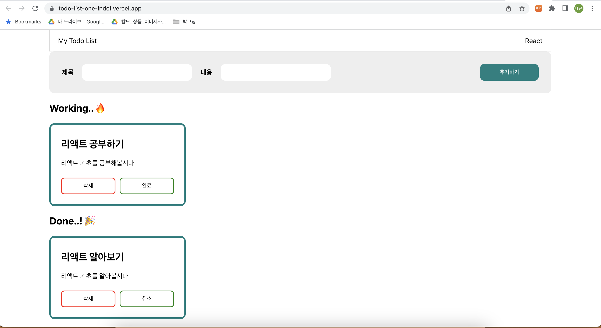

# [항해99] 10기 e반 3조 박태근

## 주특기 입문주차 개인 과제

### 1. 실행화면

> [link](https://todo-list-one-indol.vercel.app/)

### 2. Components

#### 1. App()

- **state 생성** : useState 배열을 생성. isDone 속성을 생성해주고 boolean 값을 넣어주었습니다. 또한 개별 요소의 식별을 위해 key값으로 uuid()를 사용하였습니다. id값은 단순히 순서를 지정하기 위한 용도로 남겨 두었습니다.
- **{deleteTodoListHandler}** filter 메소드를 사용하여 받아오는 key값과 다른 key값을 가진 요소들만으로 새로운 배열을 만드는 함수를 만들었습니다.
- **{onChangeHandler}** isDone 값을 변경해주는 함수를 만들었습니다. findIndex를 사용하여 받아오는 key값과 같은 요소의 index를 반환하고 spread sytax로 배열복사 해주면서 isDone값을 반대 bool값으로 변경해줍니다. 이를 state로 변경해줍니다.
- **{workingLists, doneLists}** filter를 사용하여 isDone값에 따라 배열을 새로 생성해주고 map으로 새로운 배열을 생성합니다. 그리고 그 데이터를 child component<List>에 props로 내려줍니다.
- **{onSubmitHandler}** 새로 입력되는 title과 desc 값을 변경해주는 state를 만들어주고 onClick시에 이를 새로운 요소로 생성해주는 eventhandler를 만들어 주었습니다. if를 사용하여 input에 아무것도 입력되지 않았을 경우에는 함수가 실행되지 않도록 하였습니다.

#### 2. List()

- Todo list의 내용을 나타내는 사각형의 card가 반복적으로 구성되어야 하기때문에 Child component로 List를 생성하였습니다.
- props를 사용하여 parent component인 App 에서 todoLists의 속성값인 .title과 .desc를 받도록 하였습니다.
- **삭제하기** 기능을 수행하는 버튼을 생성하고 eventhandler인 {deleteTodoListHandler} 와 연결되어 있습니다. 연결시에 key값을 parameter로 넘겨줍니다.
- **완료,취소** 기능을 수행하는 버튼을 생성하여 eventhandler인 {onChangeHandler} 와 연결되어 있습니다. 작동시에 key값을 넘겨주고 해당 key값을 가지고 있는 요소의 isDone값을 역전해줍니다.
- **완료,취소** props로 받는 isDone 값에 따라 버튼이 취소 혹은 완료로 변환되도록 삼항연산자로 구현하였습니다.
